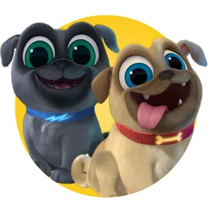
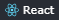

 

## **📌 FRONTEND**

 

## **📌 BACKEND**

 

## **📌 OTHERS**

# **DOGS** 

Web creada para mostrar perros de distintas razas, obtenidos a través del consumo de una API web, con búsquedas, filtrados combinados y ordenamientos alternativos. Además se crearon distintos endpoints del backend y diferentes views de la página.

