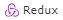

 

## **📌 FRONTEND**

 

## **📌 BACKEND**

 

## **📌 OTHERS**

# **DOGS** 

Website created to show dogs of different breeds, obtained through the consumption of a web API, with searches, combined filtering and alternative ordering. In addition, different backend endpoints and different page views were created.
Realizada con ReactJS, Javascript, Sequelize, PostgreSQL, Redux, ExpressJS

